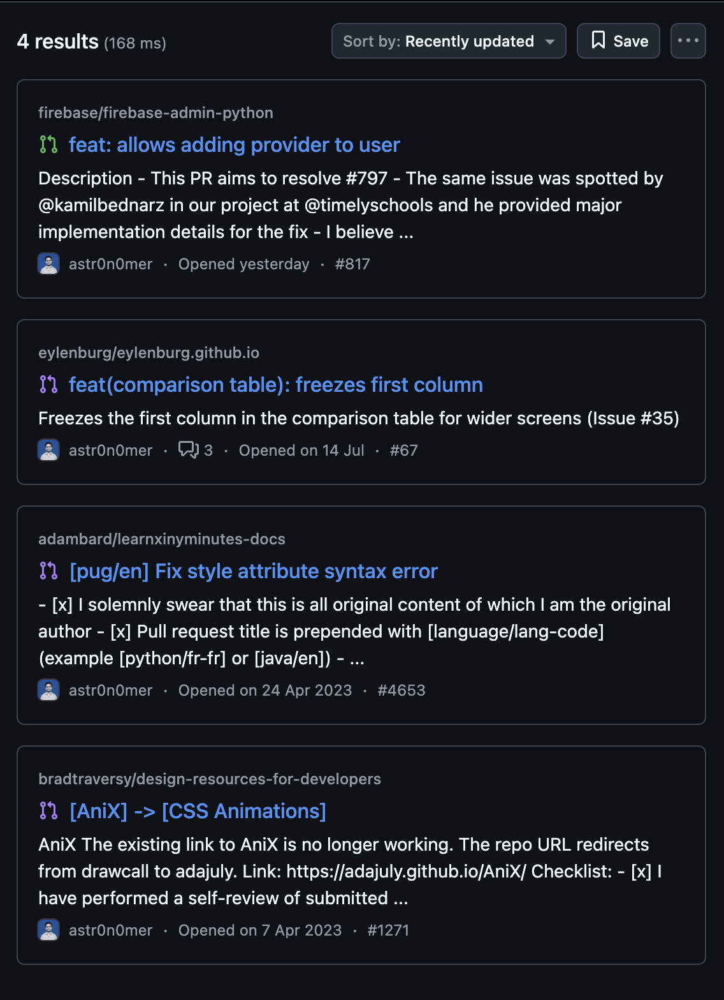
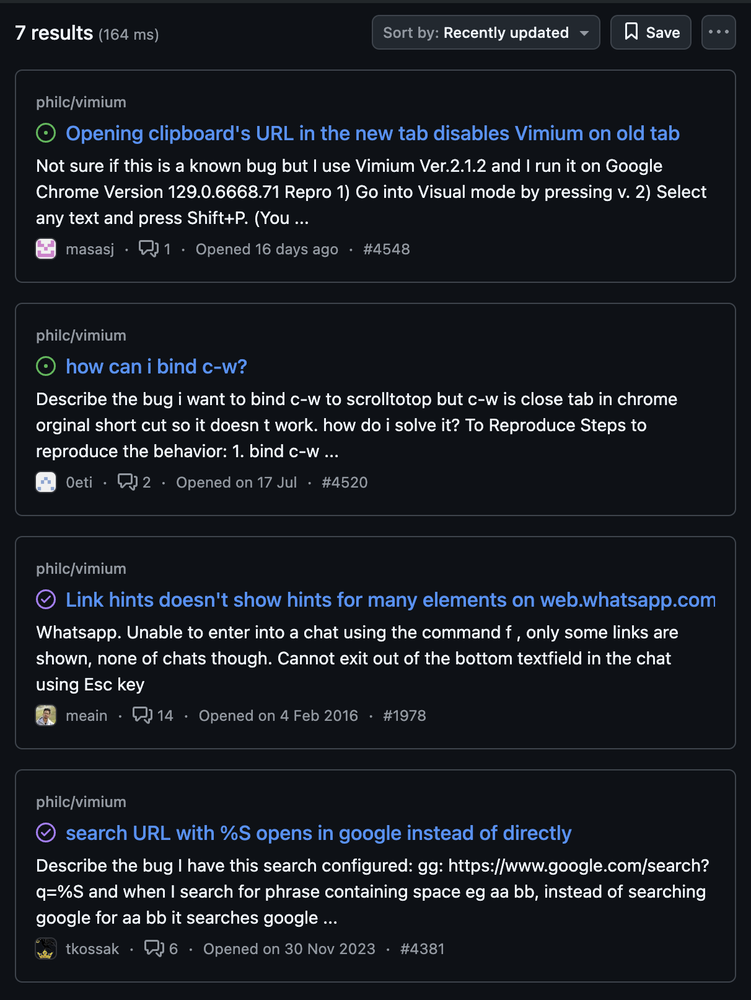

# 💫 About Me:

    

    <ul>
        <li>🚀 Fullstack Engineer specializing in React, TypeScript, and FastAPI</li>
        <li>🎓 Built EdTech solutions serving 200+ U.S. school districts, contributing to $3M+ ARR</li>
        <li>💡 Passionate about creating scalable, well-tested applications with modern infrastructure</li>
        <li>🔧 Experienced with AWS, Docker, Terraform, and CI/CD pipelines</li>
    </ul>

## 🌐 Socials:

 

# 💻 Tech Stack:

### Languages

### Frontend Development

### Backend & Database

### DevOps & Tools

 

# 📊 GitHub Stats:

    <a href="https://github.com/astr0n0mer/">
        <!--  -->
        
    </a>
    <a href="https://github.com/astr0n0mer/">
        <!--  -->
        
    </a>
    <!--  -->
    <!--  -->
    <!--  -->
    <!--  -->

 

### 🤝 OSS Involvement

 

| [Pull Requests](https://github.com/search?q=author%3Aastr0n0mer+-user%3Aastr0n0mer&type=pullrequests&s=updated&o=desc) | [Issues](https://github.com/search?q=is%3Aissue+commenter%3Aastr0n0mer+-user%3Aastr0n0mer&type=issues&s=updated&o=desc) |
| --- | --- |
|  |  |

 

### 🔝 Top Contributed Repo

 

<!--  -->

 

## 🏆 GitHub Trophies

 

    
    

    
    

        Handcrafted with 💖 by
        <a href="https://github.com/astr0n0mer">Imran Khan</a>
    

<!-- Proudly created with GPRM ( https://gprm.itsvg.in ) -->
